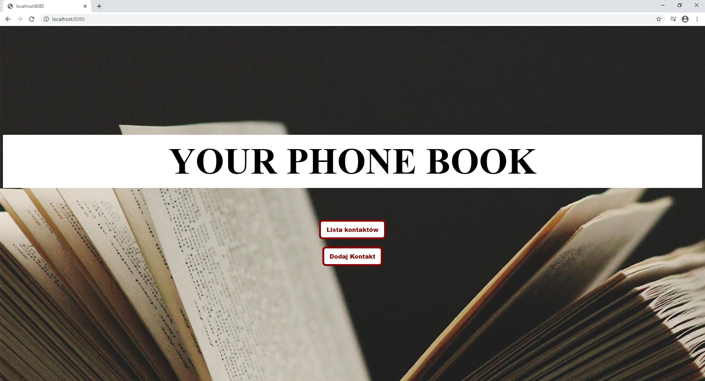
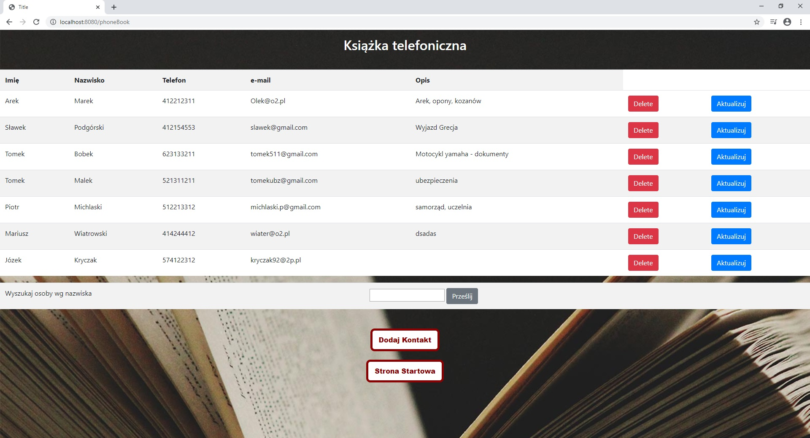
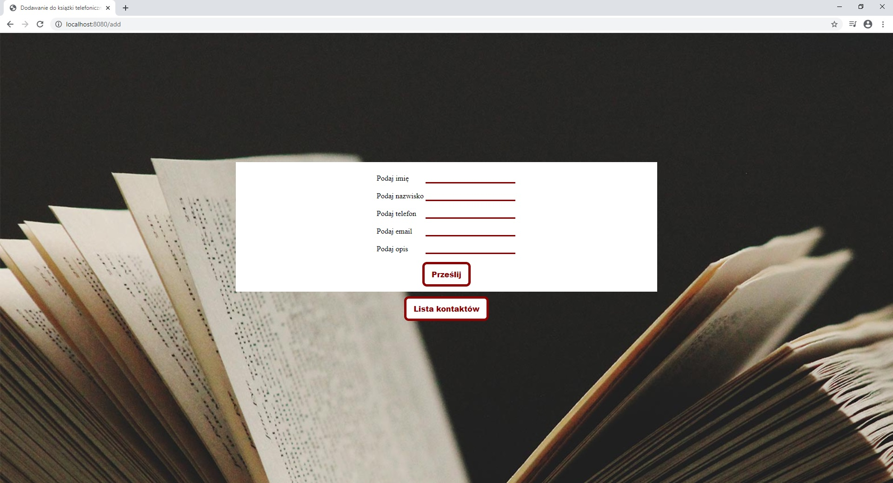
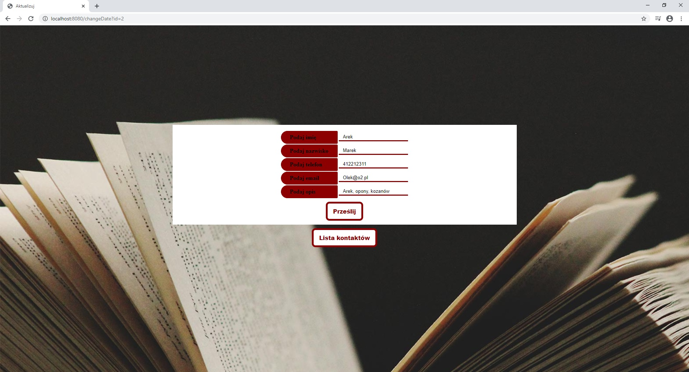

# PhoneBook

## Table of contents
* [General info](#general-info)
* [Technologies](#technologies)
* [Screenshots](#screenshots)

## General info
This is my first project using spring technology. The beginnings were quite difficult. 
I studied java for a long time and after creating the descop application I realized that I want to do something 
in the technology for web application. so I chose Spring framework and created a simple application - Phone book.

## Technologies
* java
* Spring
* SQL
* Html
* Css
* Thymeleaf
* H2database

## Screenshots
Strona startowa aplikacji.

